# Diagramas de Execucao e Arquitetura

Este documento descreve os fluxos da branch `tcc-bcc-marcos` do benchmark de
multiplicacao de matrizes.

Os diagramas usam Mermaid. No GitHub, eles sao renderizados automaticamente em
arquivos Markdown.

## Escopo da Branch

- Orquestradores: `run_all.sh` e `run_all.ps1`
- Benchmarks principais: C, C++, Java e Python em `src/`
- Gerador de graficos: `src/plot_benchmarks.py`
- Coleta de sistema Linux/WSL: `src/gen_sysinfo_md.sh`
- Saidas por execucao: `out/<run_id>/`
- Variantes/experimentos tambem estao em `src/`: Rust, Julia, Elixir, BLAS e `teste.py`

Nesta branch, os benchmarks principais ainda escrevem os CSVs na raiz do
repositorio. Depois disso, `run_all.sh` ou `run_all.ps1` move os arquivos para
`out/<run_id>/`.

## Visao Geral

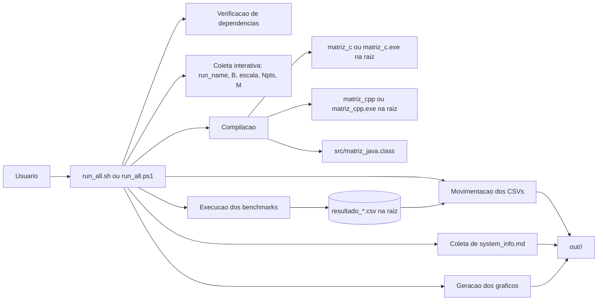

## Componentes e Responsabilidades

| Componente | Responsabilidade |
| --- | --- |
| `run_all.sh` | Fluxo Linux/WSL: verifica ou instala dependencias, compila, executa, move CSVs, coleta `system_info.md` e gera graficos. |
| `run_all.ps1` | Fluxo Windows PowerShell: verifica dependencias, compila, executa, move CSVs e gera graficos. |
| `src/matriz_c.c` | Benchmark C; escolhe `resultado_c.csv` ou `resultado_c_O3.csv` pela quantidade de argumentos. |
| `src/matriz_cpp.cpp` | Benchmark C++; escolhe `resultado_cpp.csv` ou `resultado_cpp_O3.csv` pela quantidade de argumentos. |
| `src/matriz_java.java` | Benchmark Java; gera `resultado_java.csv` com colunas `N,TCS,TAM`. |
| `src/matriz_python.py` | Benchmark Python puro; gera `resultado_python.csv` com colunas `N,TCS,TAM`. |
| `src/gen_sysinfo_md.sh` | Gera `system_info.md` em Linux/WSL, com dados do host Windows quando possivel. |
| `src/plot_benchmarks.py` | Le CSVs, normaliza algumas diferencas de coluna e salva graficos PNG. |

## Sequencia Ponta a Ponta

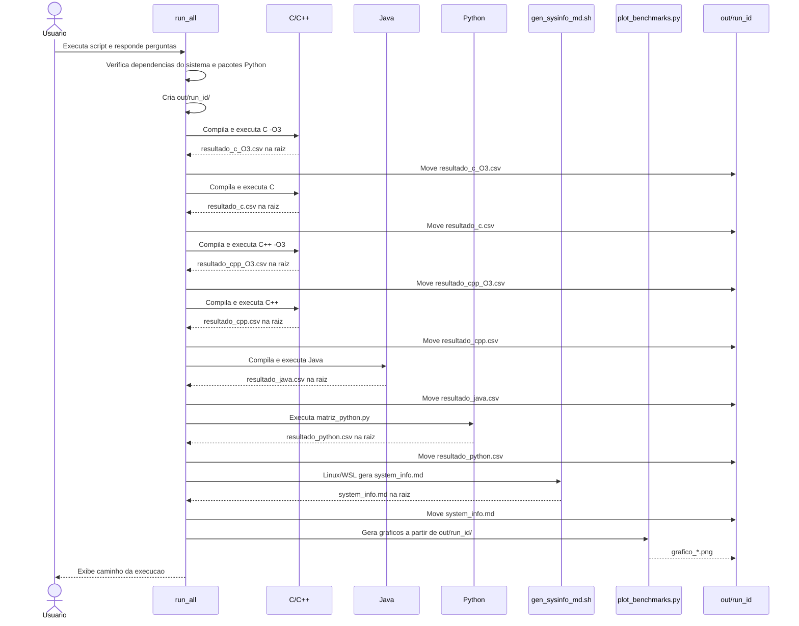

## Fluxo Linux/WSL

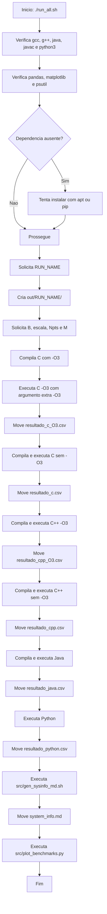

## Fluxo Windows PowerShell

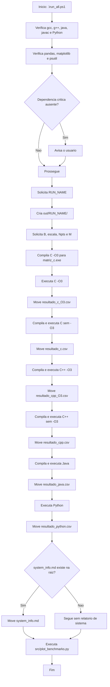

## Contrato dos Benchmarks Principais

Os executaveis principais recebem:

```text
B Npts M escala
```

C e C++ recebem um quinto argumento opcional usado pelos scripts para selecionar
o nome de saida da versao `-O3`:

```text
B Npts M escala "-O3"
```

| Argumento | Significado |
| --- | --- |
| `B` | Maior valor de `N` a ser gerado. |
| `Npts` | Quantidade de pontos entre `100` e `B`. |
| `M` | Quantidade de repeticoes para calcular a media. |
| `escala` | `0` para logaritmica, `1` para linear. |
| quinto argumento | Apenas C/C++; quando presente, muda o arquivo para `*_O3.csv`. |

## Formatos de CSV na Branch

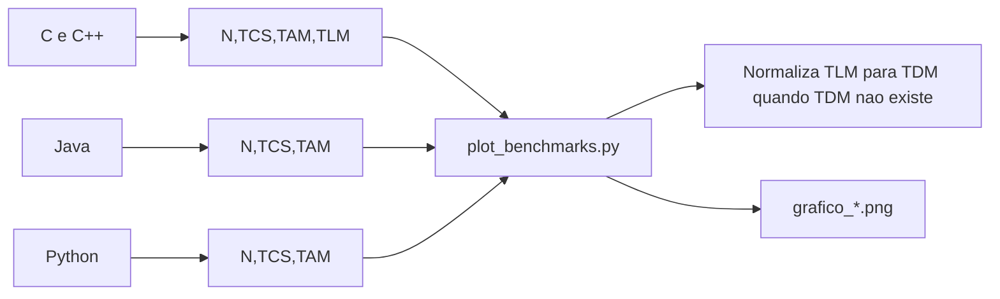

Observacoes:

- `TCS`: tempo de calculo da multiplicacao.
- `TAM`: tempo de alocacao e inicializacao.
- `TLM`: tempo de liberacao de memoria em C/C++; equivale ao conceito atual de `TDM`.
- Java e Python nao registram coluna de liberacao/desalocacao nessa branch.
- O plotador so plota uma metrica quando a coluna existe ou foi normalizada.

## Ciclo Interno de um Benchmark

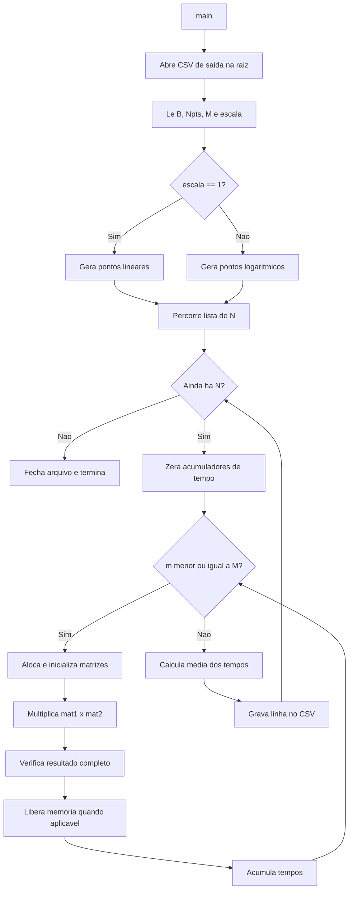

## Detalhe da Repeticao Cronometrada

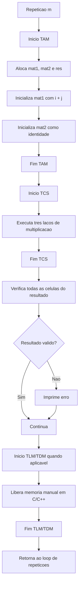

## Geracao dos Pontos de N

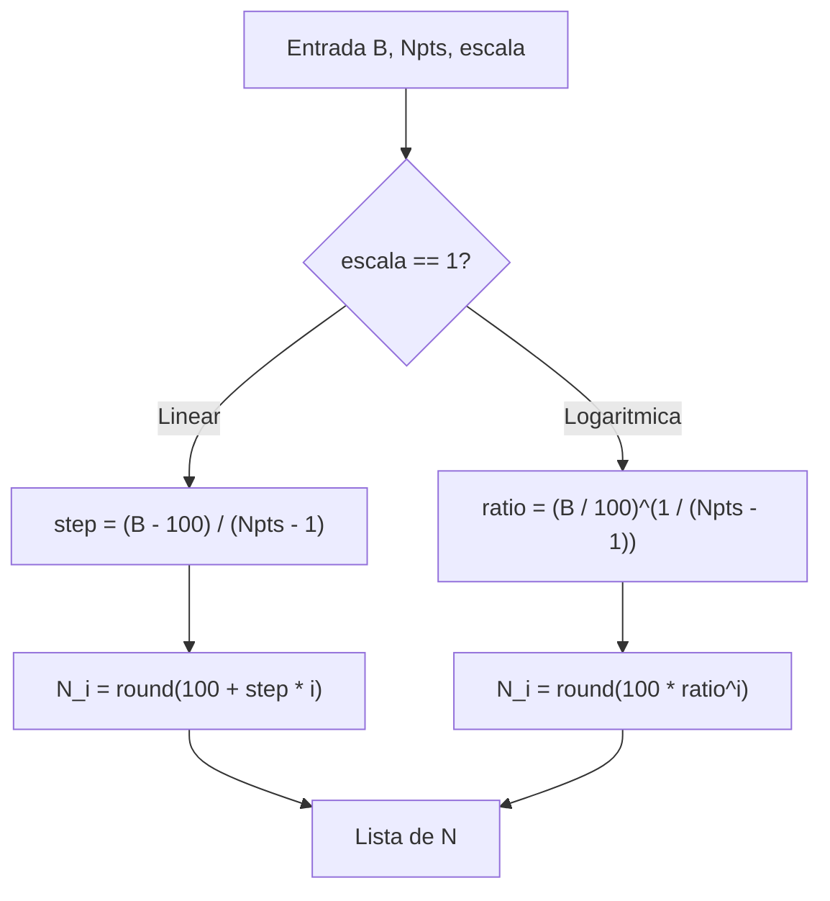

## Algoritmo de Multiplicacao

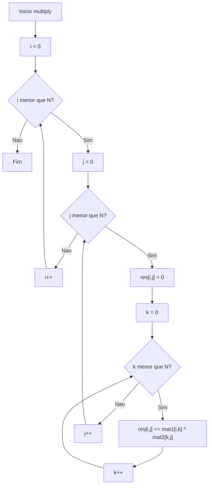

## Fluxo de Dados e Artefatos

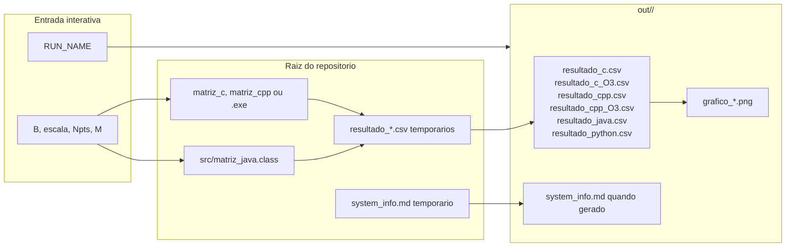

## Geracao de Graficos

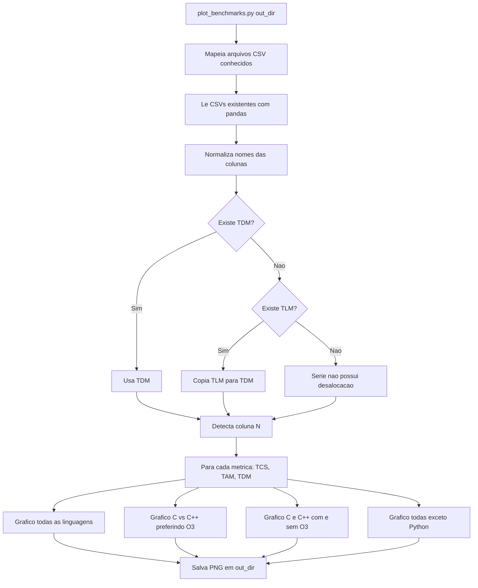

## Coleta de Informacoes de Sistema

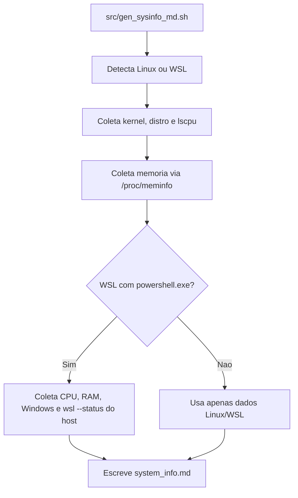

## Estados de uma Execucao

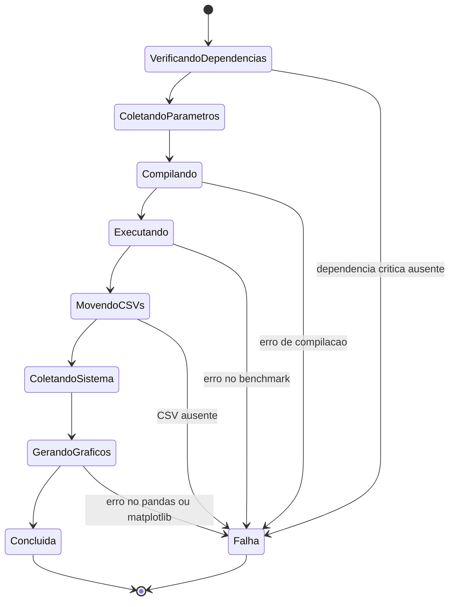

## Integracao de Nova Linguagem

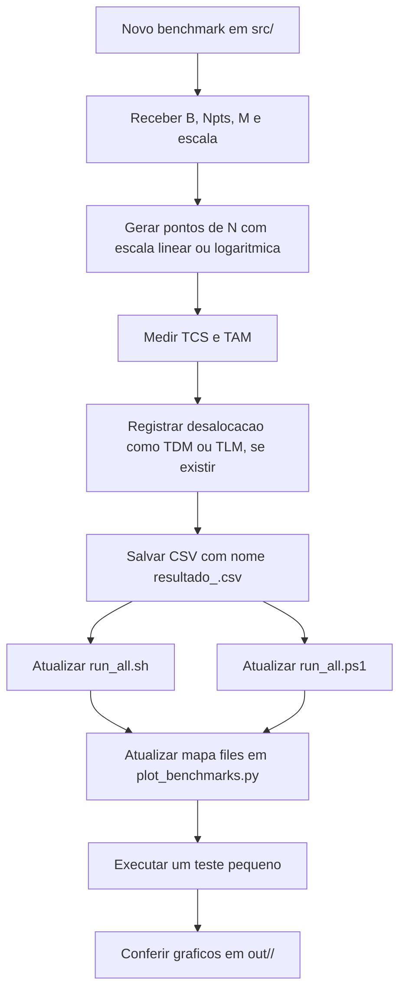

## Pontos de Atencao Metodologica

- Nao ha rodada de warm-up separada nessa branch; todas as `M` repeticoes entram na media.
- C e C++ usam `clock()` e matrizes como ponteiros para ponteiros, nao buffers planos.
- Java usa `int[][]`, que tambem e um array de arrays.
- Python usa listas de listas e depende de `psutil`, embora o uso de memoria esteja comentado na saida.
- A verificacao do resultado percorre a matriz inteira, o que adiciona trabalho fora do `TCS`.
- O segundo operando e a matriz identidade, entao o resultado esperado e `i + j`.
- `run_all.sh` tenta instalar dependencias automaticamente com `sudo apt`, o que pode pedir senha.
- Nao ha validador automatico nesta branch; a verificacao final e a existencia dos CSVs e PNGs em `out/<run_id>/`.
