# Diagramas de Execucao e Arquitetura

Este documento descreve os fluxos do benchmark publicavel de multiplicacao de matrizes:
C, C++, Java e Python executados por `run_all.sh` ou `run_all.ps1`.

Os diagramas usam Mermaid. No GitHub, eles sao renderizados automaticamente em arquivos Markdown.

## Escopo do Fluxo Publicavel

- Codigo-fonte principal: `src/`
- Orquestradores: `run_all.sh` e `run_all.ps1`
- Scripts auxiliares: `scripts/`
- Saida padrao de cada execucao: `out/<run_id>/`
- Experimentos em `experiments/` ainda nao fazem parte do fluxo publicavel.

## Visao Geral

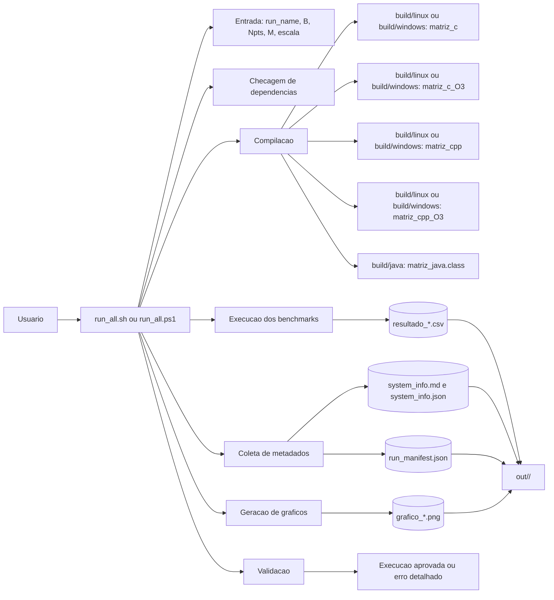

## Componentes e Responsabilidades

| Componente | Responsabilidade |
| --- | --- |
| `run_all.sh` | Orquestra execucao Linux/WSL: valida parametros, compila, executa, coleta sistema, gera manifest, plota e valida. |
| `run_all.ps1` | Orquestra execucao Windows PowerShell com o mesmo contrato do fluxo Linux/WSL. |
| `src/matriz_c.c` | Benchmark C, incluindo versao compilada normal e `-O3`. |
| `src/matriz_cpp.cpp` | Benchmark C++, incluindo versao compilada normal e `-O3`. |
| `src/matriz_java.java` | Benchmark Java com `int[][]`, compilado para `build/java/`. |
| `src/matriz_python.py` | Benchmark Python puro. |
| `src/plot_benchmarks.py` | Le CSVs de uma execucao e gera graficos PNG para TCS, TAM e TDM. |
| `scripts/gen_sysinfo_md.sh` | Gera `system_info.md` e `system_info.json` em Linux/WSL. |
| `scripts/validate_run.py` | Valida CSVs, metadados JSON/MD e existencia dos graficos. |

## Sequencia Ponta a Ponta

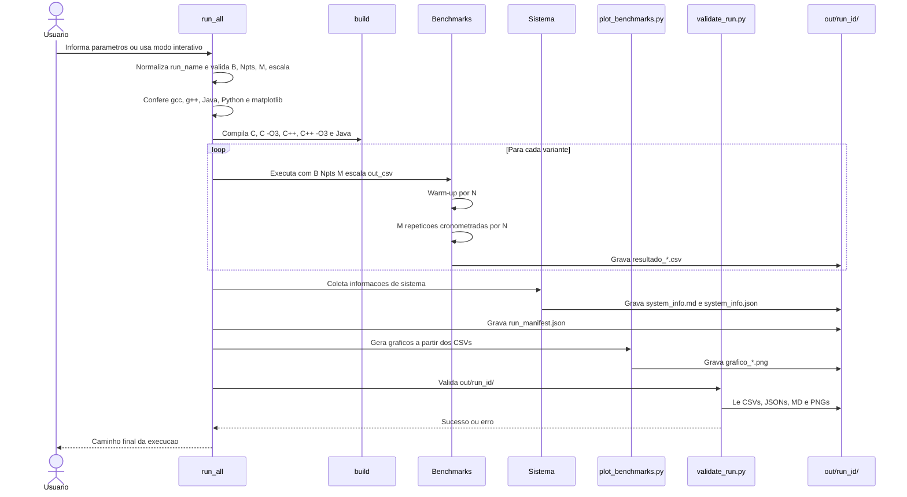

## Fluxo do Orquestrador Linux/WSL

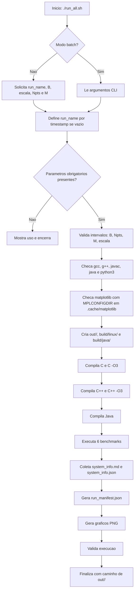

## Fluxo do Orquestrador Windows PowerShell

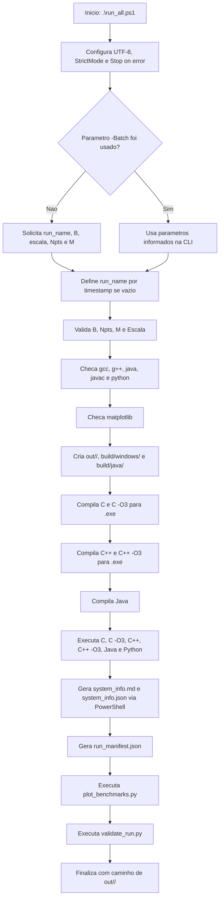

## Contrato dos Benchmarks

Todos os benchmarks principais recebem os mesmos argumentos:

```text
B Npts M escala out_csv
```

| Argumento | Significado | Regras atuais |
| --- | --- | --- |
| `B` | Maior valor de `N` | Inteiro entre `100` e `100000` |
| `Npts` | Quantidade de pontos de medicao | Inteiro entre `2` e `10000` |
| `M` | Repeticoes cronometradas para media | Inteiro entre `1` e `100000` |
| `escala` | Geracao dos pontos de `N` | `0` logaritmica, `1` linear |
| `out_csv` | Caminho do CSV de saida | Arquivo dentro de `out/<run_id>/` |

Saida CSV comum:

```csv
N,TCS,TAM,TDM
```

| Coluna | Significado |
| --- | --- |
| `N` | Dimensao da matriz quadrada `N x N` |
| `TCS` | Tempo medio de calculo da multiplicacao |
| `TAM` | Tempo medio de alocacao e inicializacao das matrizes |
| `TDM` | Tempo medio de desalocacao; em Java e Python e `0.0` |

## Ciclo Interno de um Benchmark

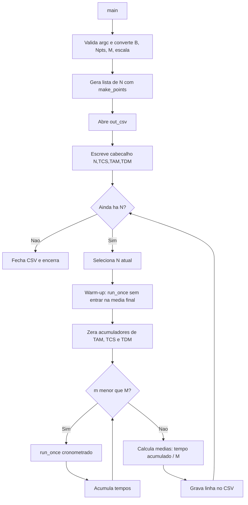

## Detalhe de `run_once`

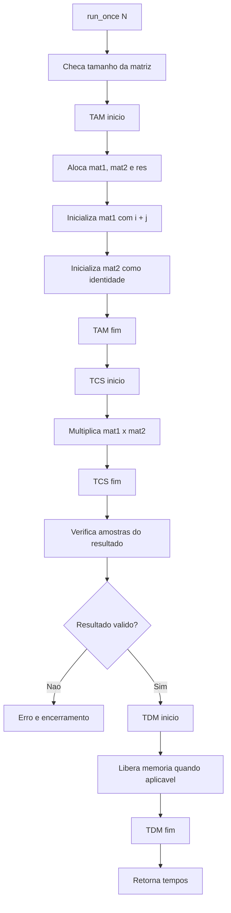

Observacoes:

- Em C e C++, as matrizes principais usam buffers contiguos em memoria.
- Em Java, a matriz e `int[][]`, ou seja, um array de arrays.
- Em Python, as matrizes sao listas de listas.
- Como `mat2` e identidade, o resultado esperado e igual a `mat1`; por isso a amostra verificada deve retornar `i + j`.

## Geracao dos Pontos de N

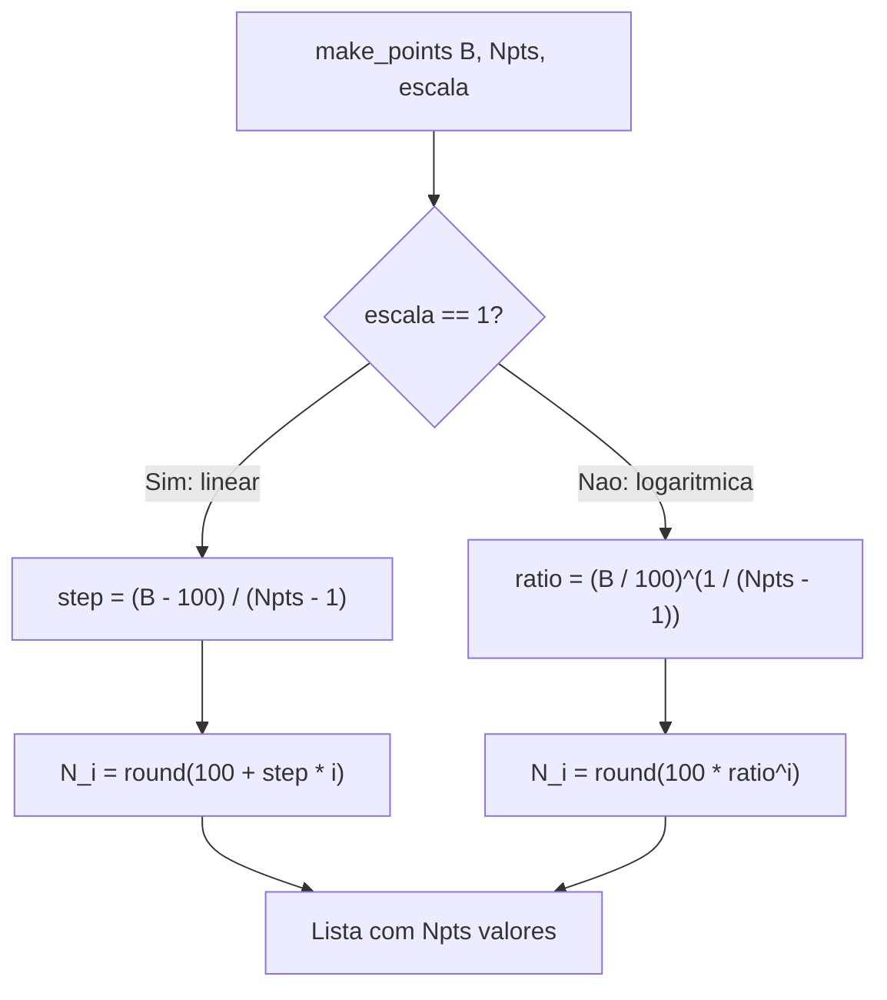

## Algoritmo de Multiplicacao

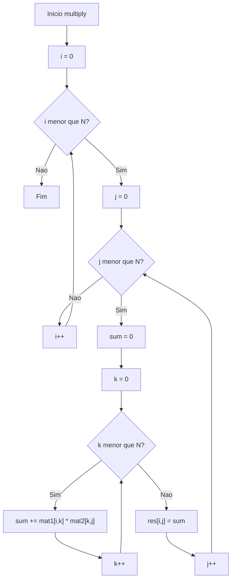

## Fluxo de Dados e Artefatos

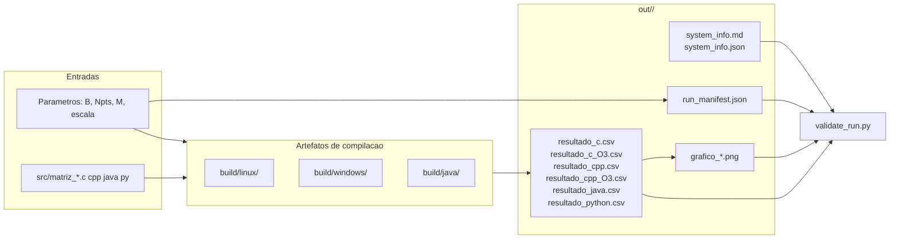

## Geracao dos Graficos

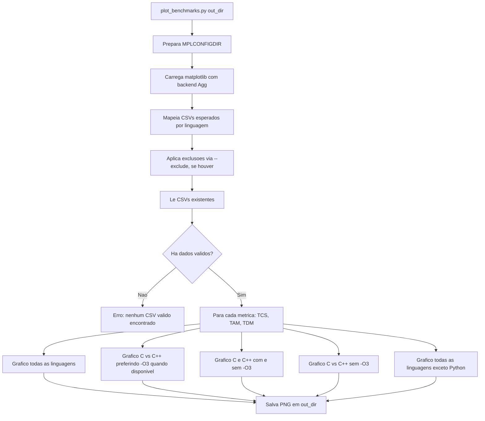

## Validacao da Execucao

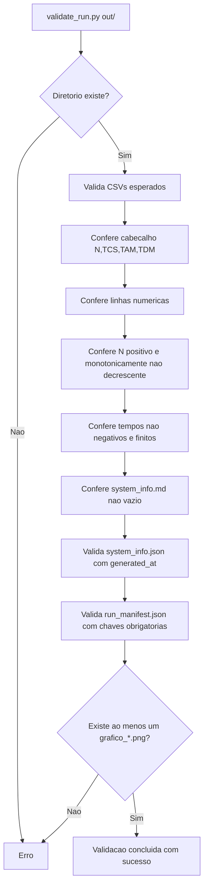

## Estrutura do Diretorio de Saida

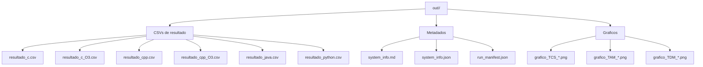

## Manifest da Execucao

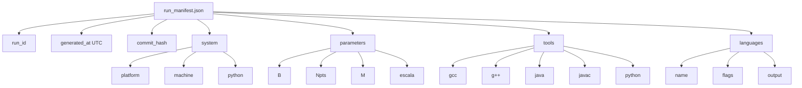

## Dependencias de Ambiente

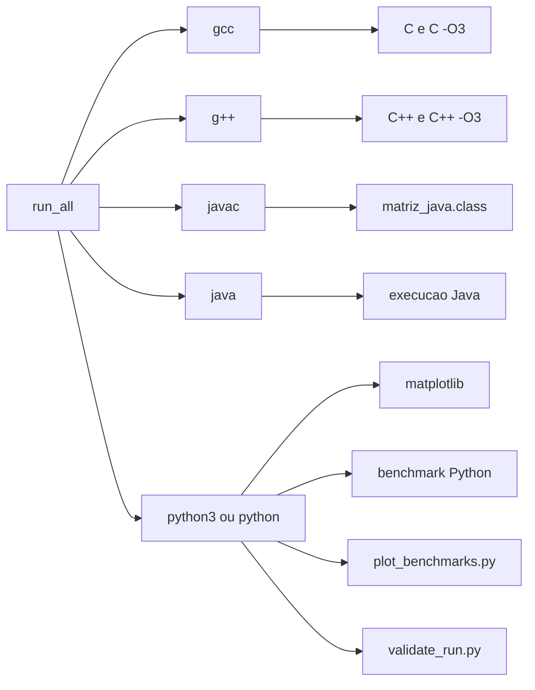

## Estados de uma Execucao

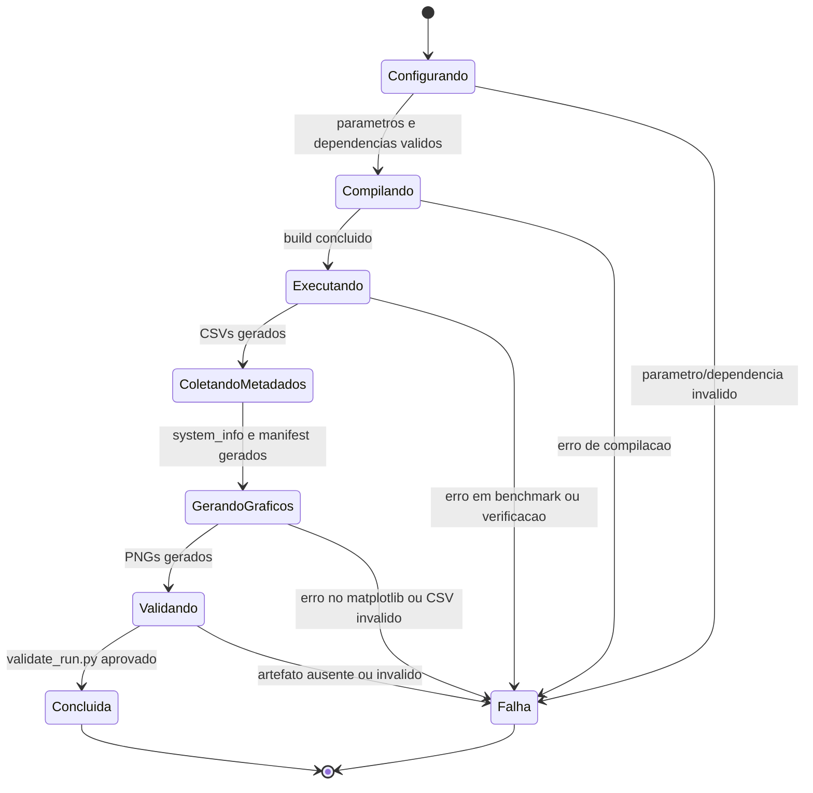

## Integracao de Nova Linguagem ao Fluxo Principal

Use este roteiro quando um experimento for promovido para `src/`.

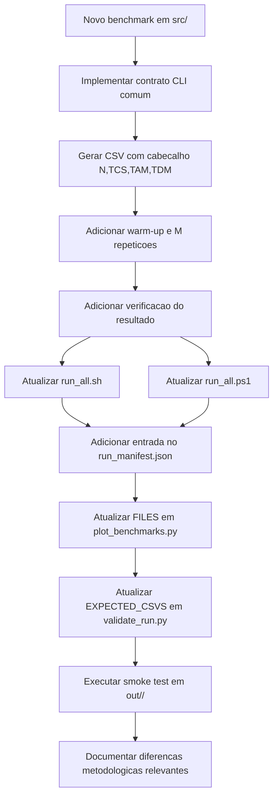

## Pontos de Atencao Metodologica

- `TAM` mede alocacao e inicializacao juntas.
- `TCS` mede apenas a multiplicacao.
- `TDM` mede liberacao explicita quando a linguagem permite; Java e Python registram `0.0`.
- O warm-up nao entra na media final.
- `M` reduz ruido por media aritmetica simples.
- O algoritmo principal e cubico, com tres lacos aninhados.
- A matriz identidade como segundo operando torna a verificacao simples sem alterar a complexidade do calculo.
- Comparacoes entre linguagens devem considerar layout de memoria, otimizacoes do compilador, JIT do Java e overhead do interpretador Python.
