# Diagramas de Execucao e Arquitetura

Este documento descreve os fluxos do benchmark publicavel de multiplicacao de matrizes:
C, C++, Java e Python formam o nucleo; Rust, Julia e Elixir entram opcionalmente por flags de `run_all.sh` ou `run_all.ps1`.

Os diagramas usam Mermaid. No GitHub, eles sao renderizados automaticamente em arquivos Markdown.

## Escopo do Fluxo Publicavel

- Codigo-fonte principal: `src/`
- Orquestradores: `run_all.sh` e `run_all.ps1`
- Scripts auxiliares: `scripts/`
- Testes de contrato e corretude: `tests/`
- Saida padrao de cada execucao: `out/<run_id>/`
- Experimentos que permanecem em `experiments/`, como BLAS, ainda nao fazem parte do fluxo publicavel.

## Visao Geral

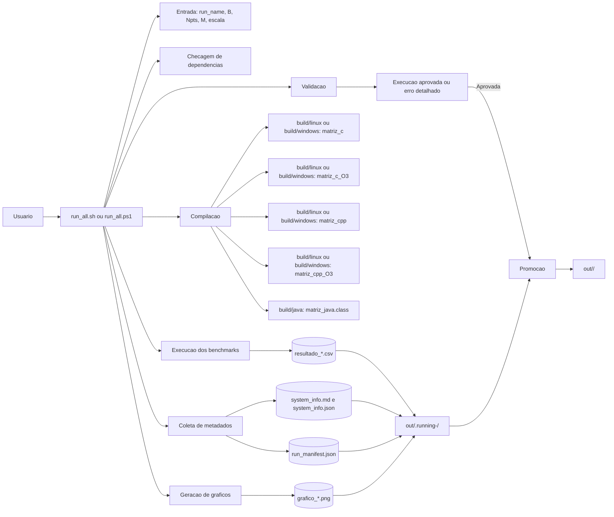

## Componentes e Responsabilidades

| Componente | Responsabilidade |
| --- | --- |
| `run_all.sh` | Orquestra execucao Linux/WSL: valida parametros, compila, executa, coleta sistema, gera manifest, plota e valida. |
| `run_all.ps1` | Orquestra execucao Windows PowerShell com o mesmo contrato do fluxo Linux/WSL. |
| `src/matriz_c.c` | Benchmark C, incluindo versao compilada normal e `-O3`. |
| `src/matriz_cpp.cpp` | Benchmark C++, incluindo versao compilada normal e `-O3`. |
| `src/matriz_java.java` | Benchmark Java com `int[][]`, compilado para `build/java/`. |
| `src/matriz_python.py` | Benchmark Python puro. |
| `src/matriz_rust.rs` | Benchmark Rust opcional, compilado quando `--with-rust`/`-WithRust` e usado. |
| `src/matriz_Julia.jl` | Benchmark Julia opcional, executado quando `--with-julia`/`-WithJulia` e usado. |
| `src/matriz_multiplication.exs` | Benchmark Elixir opcional, executado quando `--with-elixir`/`-WithElixir` e usado. |
| `src/plot_benchmarks.py` | Le CSVs de uma execucao e gera graficos PNG para TCS, TAM e TDM. |
| `scripts/gen_sysinfo_md.sh` | Gera `system_info.md` e `system_info.json` em Linux/WSL. |
| `scripts/validate_run.py` | Valida CSVs, metadados JSON/MD e existencia dos graficos. |
| `tests/` | Reune regressões de contrato e testes pequenos de corretude nao identidade. |

## Sequencia Ponta a Ponta

```mermaid
sequenceDiagram
    actor U as Usuario
    participant R as run_all
    participant B as build
    participant C as Benchmarks
    participant S as Sistema
    participant P as plot_benchmarks.py
    participant V as validate_run.py
    participant O as out/.running-run_id/ (staging)

    U->>R: Informa parametros ou usa modo interativo
    R->>R: Normaliza run_name e valida B, Npts, M, escala
    R->>R: Confere gcc, g++, Java, Python e matplotlib
    R->>O: Confere colisoes e cria staging
    R->>B: Compila C, C -O3, C++, C++ -O3 e Java

    loop Para cada variante central
        R->>C: Executa com B Npts M escala out_csv
        C->>C: Warm-up por N
        C->>C: M repeticoes cronometradas por N
        C->>O: Grava resultado_*.csv
    end

    opt Flags de linguagens extras
        R->>R: Confere rustc, julia e/ou elixir no ponto de uso
        R->>B: Compila Rust, se solicitado
        R->>C: Executa cada extra solicitada
        C->>O: Grava o respectivo resultado_*.csv
    end

    R->>S: Coleta informacoes de sistema
    S->>O: Grava system_info.md e system_info.json
    R->>O: Grava run_manifest.json
    R->>P: Gera graficos a partir dos CSVs
    P->>O: Grava grafico_*.png
    R->>V: Valida out/.running-run_id/
    V->>O: Le CSVs, JSONs, MD e PNGs
    V-->>R: Sucesso ou erro
    alt Sucesso
        R->>O: Promove (rename) para out/run_id/
        R-->>U: Caminho final: out/run_id/
    else Erro depois da criacao do staging
        R-->>U: Aborta; out/.running-run_id/ preservado, out/run_id/ nunca criado
    end
```

## Fluxo do Orquestrador Linux/WSL

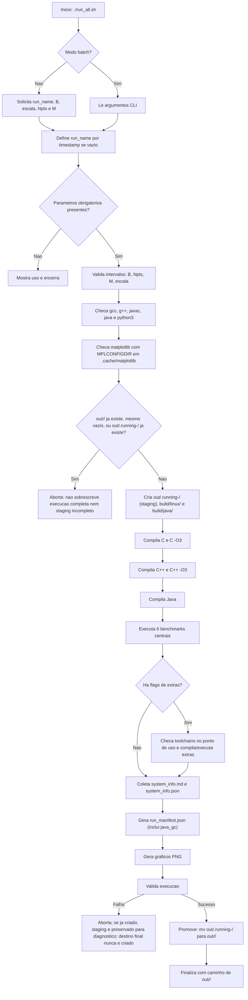

## Fluxo do Orquestrador Windows PowerShell

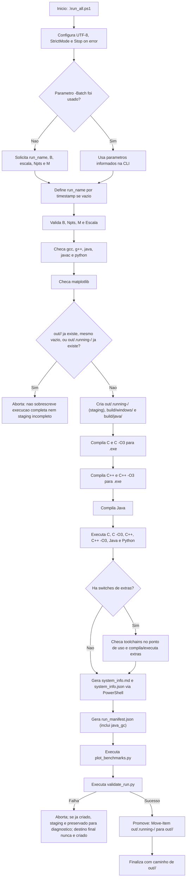

## Contrato dos Benchmarks

Todos os benchmarks principais recebem os mesmos argumentos:

```text
B Npts M escala out_csv
```

| Argumento | Significado | Regras atuais |
| --- | --- | --- |
| `B` | Maior valor de `N` | Inteiro entre `100` e `100000` |
| `Npts` | Quantidade de pontos de medicao | Inteiro entre `2` e `10000` |
| `M` | Repeticoes cronometradas para media | Inteiro entre `1` e `100000` |
| `escala` | Geracao dos pontos de `N` | `0` logaritmica, `1` linear |
| `out_csv` | Caminho do CSV de saida | Arquivo dentro de `out/<run_id>/` |

Saida CSV comum:

```csv
N,TCS,TAM,TDM
```

| Coluna | Significado |
| --- | --- |
| `N` | Dimensao da matriz quadrada `N x N` |
| `TCS` | Tempo medio de calculo da multiplicacao |
| `TAM` | Tempo medio de alocacao e inicializacao das matrizes |
| `TDM` | Tempo medio de desalocacao; em Java, Python, Julia e Elixir e `0.0` |

## Ciclo Interno de um Benchmark

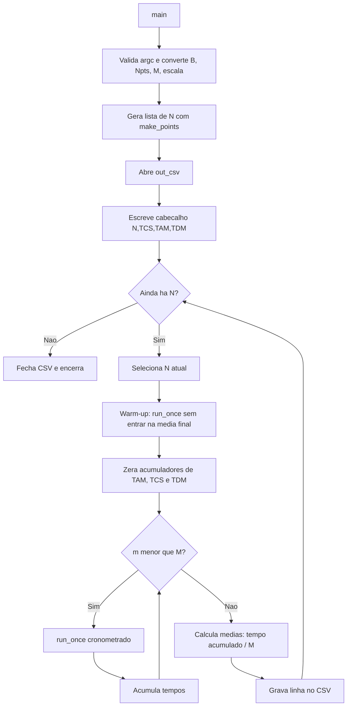

## Detalhe de `run_once`

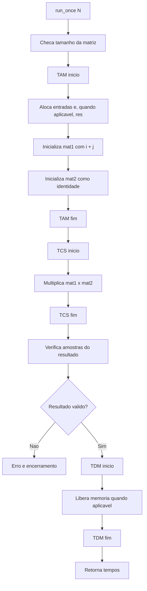

Observacoes:

- Em C e C++, as matrizes principais usam buffers contiguos em memoria.
- Em Java, a matriz e `int[][]`, ou seja, um array de arrays.
- Em Python, as matrizes sao listas de listas.
- Como `mat2` e identidade, o resultado esperado e igual a `mat1`; por isso a amostra verificada deve retornar `i + j`.

## Geracao dos Pontos de N

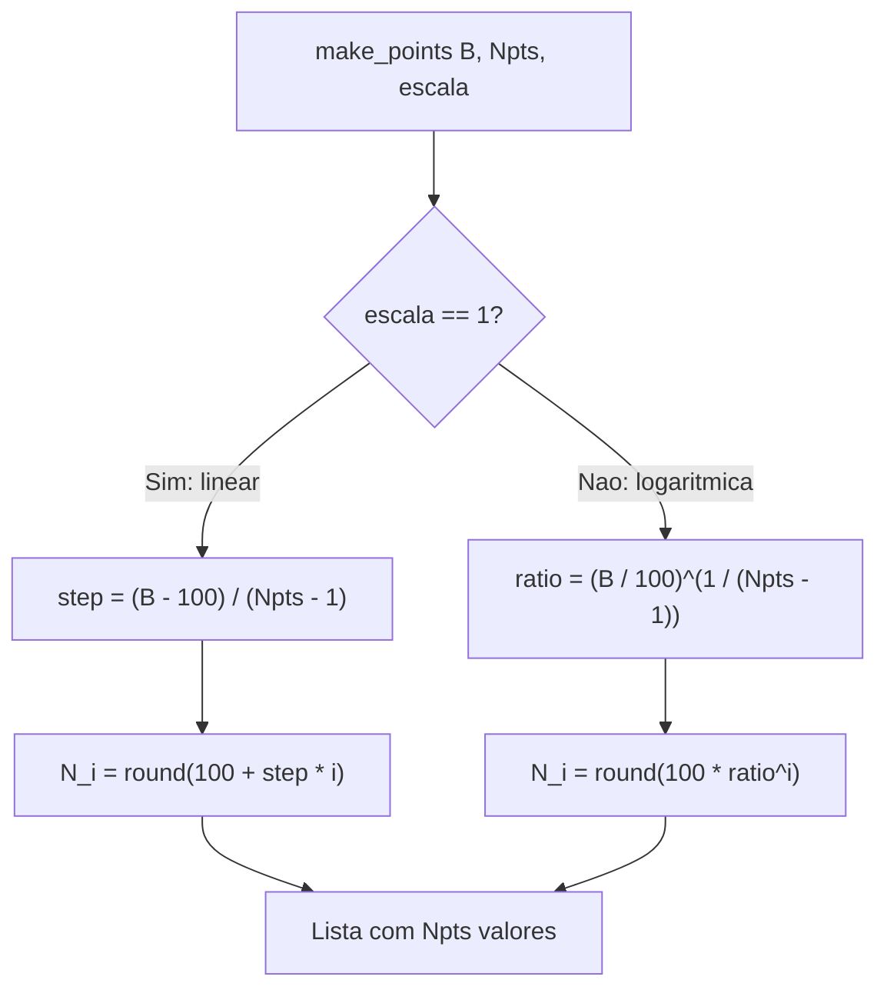

## Algoritmo de Multiplicacao

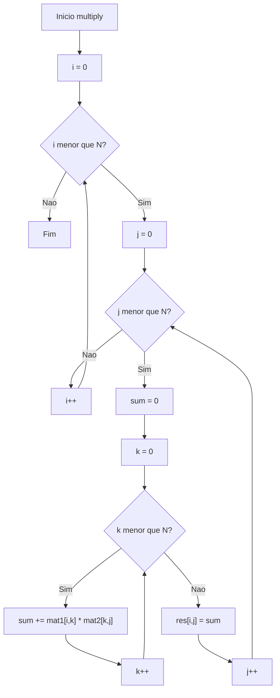

## Fluxo de Dados e Artefatos

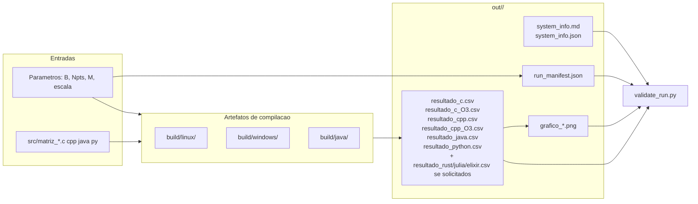

## Geracao dos Graficos

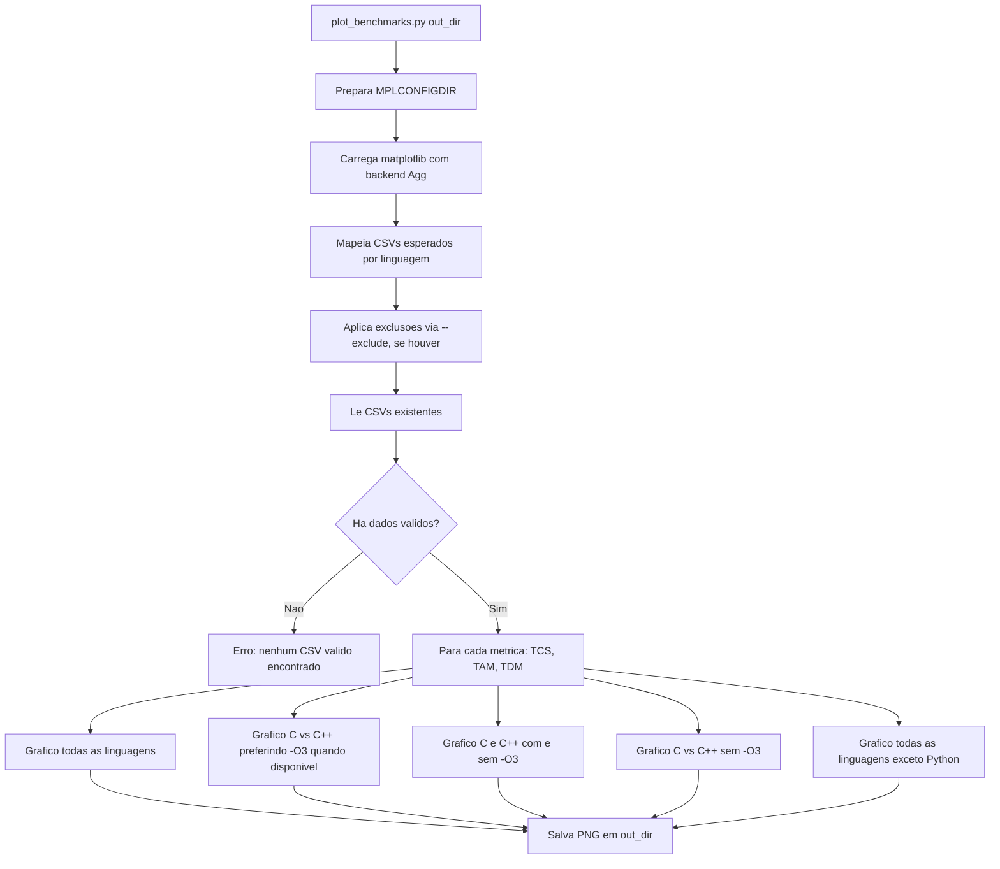

## Validacao da Execucao

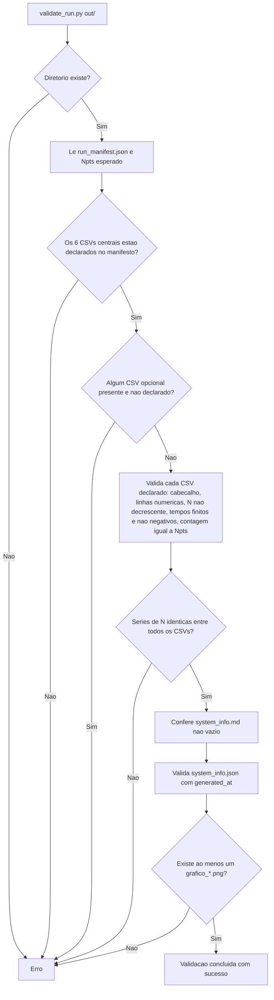

O manifesto é a fonte autoritativa para os seis CSVs centrais e os três opcionais reconhecidos: qualquer um deles presente no diretório mas ausente do manifesto invalida a execução, e uma saída declarada mas ausente também invalida. CSVs de nomes arbitrários ainda não são rejeitados pelo validador.

## Estrutura do Diretorio de Saida

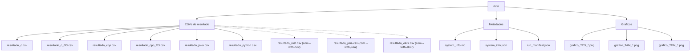

## Manifest da Execucao

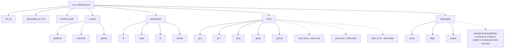

## Dependencias de Ambiente

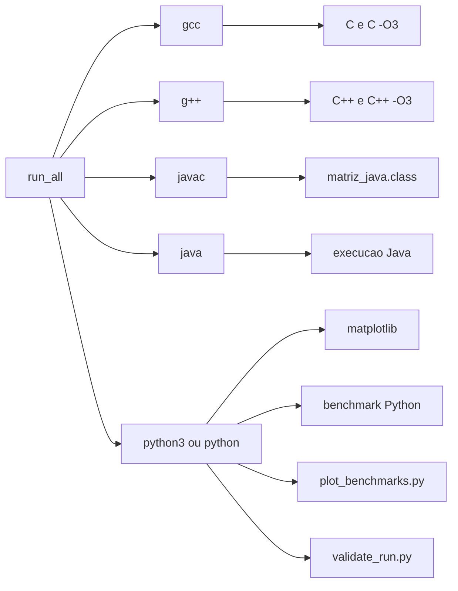

## Estados de uma Execucao

```mermaid
stateDiagram-v2
    [*] --> Configurando
    Configurando --> EmStaging: parametros e dependencias centrais validos, cria out/.running-<run_id>/
    Configurando --> Falha: parametro/dependencia central invalido, ou out/<run_id>/ ou out/.running-<run_id>/ ja existem
    EmStaging --> Compilando
    Compilando --> Executando: build concluido
    Compilando --> FalhaEmStaging: erro de compilacao
    Executando --> ColetandoMetadados: CSVs gerados
    Executando --> FalhaEmStaging: toolchain extra ausente, erro em benchmark ou verificacao
    ColetandoMetadados --> GerandoGraficos: system_info e manifest gerados (inclui java_gc)
    GerandoGraficos --> Validando: PNGs gerados
    GerandoGraficos --> FalhaEmStaging: erro no matplotlib ou CSV invalido
    Validando --> Promovendo: validate_run.py aprovado
    Validando --> FalhaEmStaging: artefato ausente ou invalido
    Promovendo --> Concluida: mv/Move-Item out/.running-<run_id>/ para out/<run_id>/
    Concluida --> [*]
    FalhaEmStaging --> [*]: out/.running-<run_id>/ preservado para diagnostico; out/<run_id>/ nunca criado
    Falha --> [*]
```

## Integracao de Nova Linguagem ao Fluxo Principal

Use este roteiro quando um experimento for promovido para `src/`. Rust, Julia e Elixir seguem este fluxo: sao **opcionais por flag**, nao obrigatorias -- nao entram em `EXPECTED_CSVS` (que permanece só com os 6 nomes centrais), so no manifesto quando a flag correspondente e usada e a execucao tem sucesso.

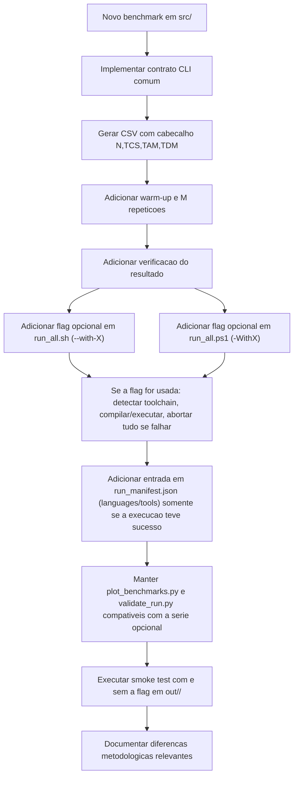

## Pontos de Atencao Metodologica

Resumo rapido; o desenho experimental completo (variaveis, controles, JIT, GC, layout de memoria por linguagem, limitacoes e ameacas a validade) esta em [METHODOLOGY.md](METHODOLOGY.md):

- `TAM` e a janela de alocacao/inicializacao, incluindo `res`, em C, C++, Java, Python, Rust e Julia. Elixir e a unica excecao: por imutabilidade, `res` so existe ao final da construcao.
- `TCS` e a janela de calculo; em Elixir inclui tambem a construcao imutavel de `res` (excecao estrutural, nao de implementacao).
- `TDM` mede uma liberacao provocada em C/C++/Rust; Java, Python, Julia e Elixir registram `0.0` porque o protocolo nao mede a liberacao automatica, nao porque ela seja instantanea.
- O warm-up nao entra na media final.
- `M` reduz ruido por media aritmetica simples; tempos individuais por repeticao nao sao preservados.
- O algoritmo principal e algoritmicamente equivalente, O(N^3), com ordem logica `i,j,k`; representacao e operacoes internas variam por linguagem.
- A matriz identidade como segundo operando torna a verificacao simples sem alterar a complexidade do calculo.
- Comparacoes entre linguagens devem considerar layout de memoria, largura dos inteiros, otimizacoes do compilador, JIT de Java/Julia/BEAM, GC e imutabilidade.
