# Diagramas de Execucao e Arquitetura

Este documento descreve os fluxos do benchmark publicavel de multiplicacao de matrizes.
C, C++, Java e Python formam o nucleo. Rust, Julia e Elixir entram opcionalmente por flags de `run_all.sh` ou `run_all.ps1`.

Os diagramas usam Mermaid e foram escritos com sintaxe conservadora para renderizacao direta no GitHub.

## Escopo do Fluxo Publicavel

- Codigo-fonte principal: `src/`
- Orquestradores: `run_all.sh` e `run_all.ps1`
- Scripts auxiliares: `scripts/`
- Testes de contrato e corretude: `tests/`
- Staging de uma execucao: `out/.running-<run_id>/`
- Saida final de uma execucao aprovada: `out/<run_id>/`
- Experimentos em `experiments/`, como BLAS, nao fazem parte do fluxo publicavel.

## Visao Geral

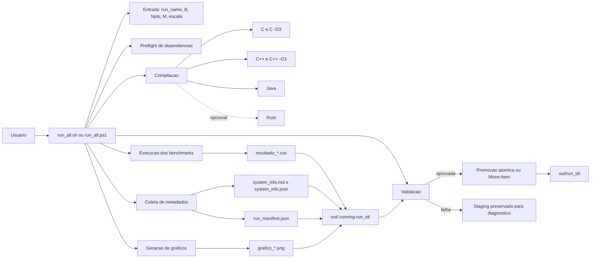

## Componentes e Responsabilidades

| Componente | Responsabilidade |
| --- | --- |
| `run_all.sh` | Orquestra Linux/WSL: valida parametros e `run_name`, faz preflight de dependencias, compila, executa, coleta sistema, gera manifesto, plota, valida e promove a execucao. |
| `run_all.ps1` | Orquestra Windows PowerShell com o mesmo contrato e verificacao explicita de codigos de saida de programas nativos. |
| `src/matriz_c.c` | Benchmark C, usado nas variantes normal e `-O3`. |
| `src/matriz_cpp.cpp` | Benchmark C++, usado nas variantes normal e `-O3`. |
| `src/matriz_java.java` | Benchmark Java com `int[][]`. |
| `src/matriz_python.py` | Benchmark Python puro. |
| `src/matriz_rust.rs` | Benchmark Rust opcional, compilado quando solicitado. |
| `src/matriz_Julia.jl` | Benchmark Julia opcional, executado quando solicitado. |
| `src/matriz_multiplication.exs` | Benchmark Elixir opcional, executado quando solicitado. |
| `src/plot_benchmarks.py` | Le os CSVs disponiveis e gera graficos PNG para TCS, TAM e TDM. |
| `scripts/gen_sysinfo_md.sh` | Gera `system_info.md` e `system_info.json` em Linux/WSL. |
| `scripts/validate_run.py` | Valida CSVs, manifesto, metadados e existencia dos graficos. |
| `tests/` | Reune regressões de contrato e testes pequenos de corretude nao identidade. |

## Sequencia Ponta a Ponta

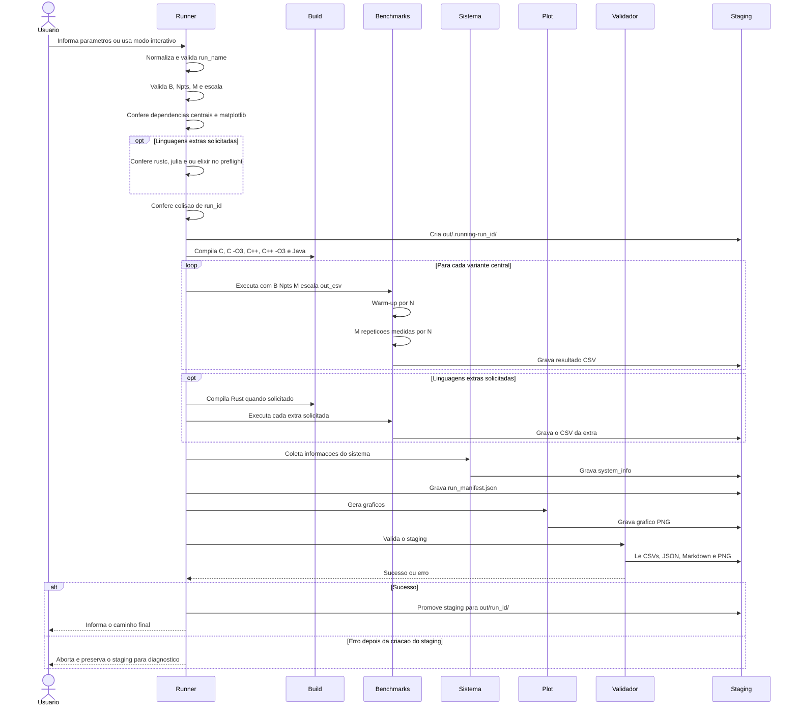

## Fluxo do Orquestrador Linux/WSL

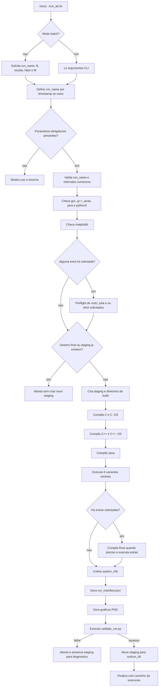

## Fluxo do Orquestrador Windows PowerShell

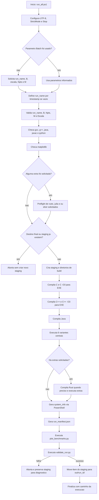

## Contrato dos Benchmarks

Todos os benchmarks principais recebem os mesmos argumentos:

```text
B Npts M escala out_csv
```

| Argumento | Significado | Regra |
| --- | --- | --- |
| `B` | Maior valor de `N` | Inteiro entre `100` e `100000` |
| `Npts` | Quantidade de pontos | Inteiro entre `2` e `10000` |
| `M` | Repeticoes medidas | Inteiro entre `1` e `100000` |
| `escala` | Geracao de `N` | `0` logaritmica, `1` linear |
| `out_csv` | Caminho do CSV | O benchmark cria os diretorios pais quando necessario e sobrescreve o arquivo. Nos runners, o caminho aponta para o staging. |

Cabecalho comum:

```csv
N,TCS,TAM,TDM
```

| Coluna | Significado |
| --- | --- |
| `N` | Dimensao da matriz quadrada `N x N` |
| `TCS` | Tempo medio da multiplicacao |
| `TAM` | Tempo medio de alocacao e inicializacao |
| `TDM` | Tempo medio de desalocacao explicita. Em Java, Python, Julia e Elixir e `0.0`. |

## Ciclo Interno de um Benchmark

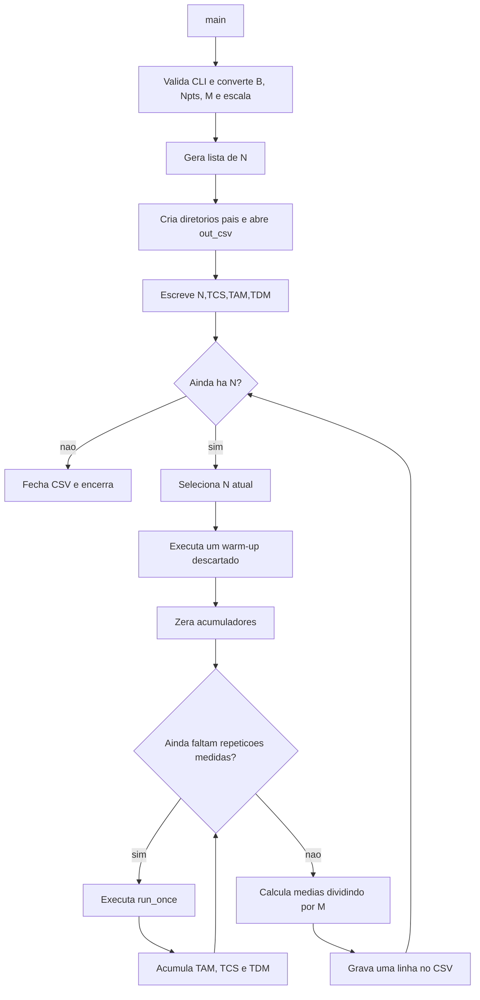

## Detalhe de `run_once`

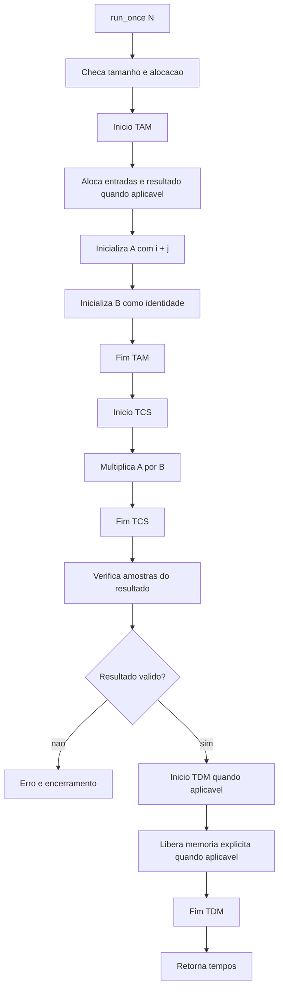

Observacoes:

- C e C++ usam buffers contiguos.
- Rust usa `Vec<i32>` plano e acessos `get_unchecked` documentados.
- Java usa `int[][]`.
- Python usa listas de listas.
- Julia usa `Matrix{Int32}` em layout column-major.
- Elixir usa tupla plana imutavel e constroi o resultado dentro de TCS.
- A validacao amostral do benchmark usa a identidade como segundo operando.
- Os testes de corretude em `tests/` usam tambem uma matriz nao identidade 2x2.

## Geracao dos Pontos de N

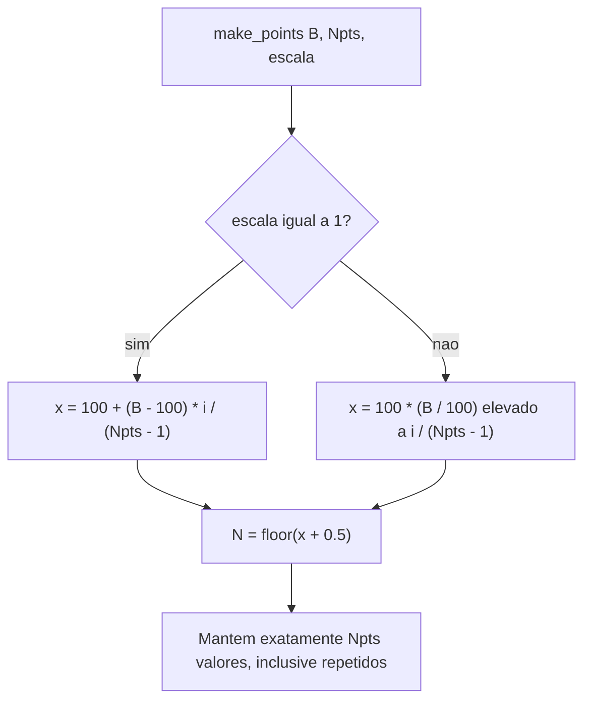

A regra de arredondamento e metade-para-cima para valores positivos, implementada de forma equivalente a `floor(x + 0.5)`. O caso linear `B=101`, `Npts=3` deve produzir `[100, 101, 101]`.

## Algoritmo de Multiplicacao

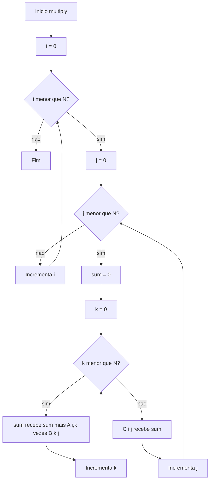

A ordem logica dos lacos e `i, j, k` em todas as implementacoes do contrato comum.

## Fluxo de Dados e Artefatos

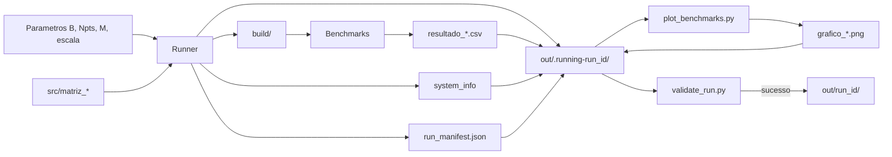

## Geracao dos Graficos

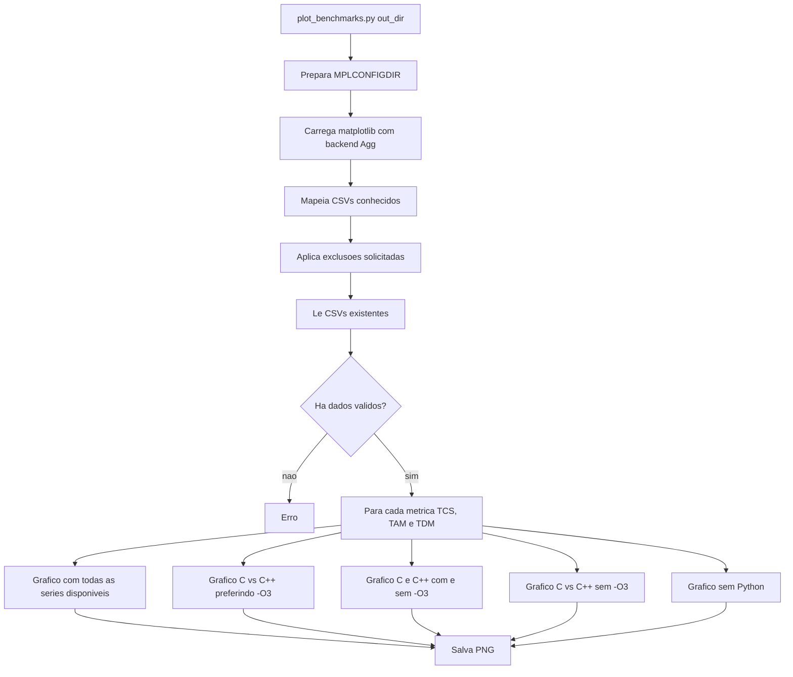

## Validacao da Execucao

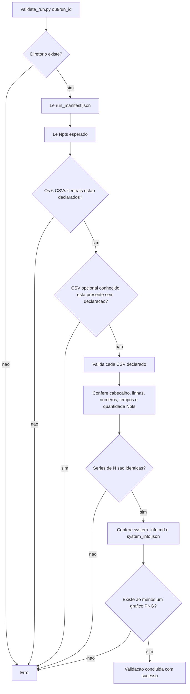

O manifesto e a fonte autoritativa para os seis CSVs centrais e para Rust, Julia e Elixir quando solicitados. Um CSV opcional conhecido presente sem declaracao invalida a execucao.

## Estrutura do Diretorio de Saida

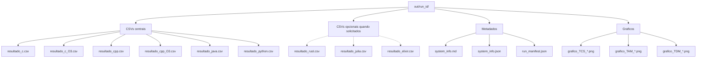

## Manifest da Execucao

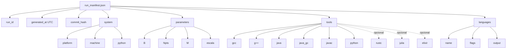

As ferramentas extras e as respectivas linguagens entram no manifesto somente quando foram solicitadas e executadas com sucesso.

## Dependencias de Ambiente

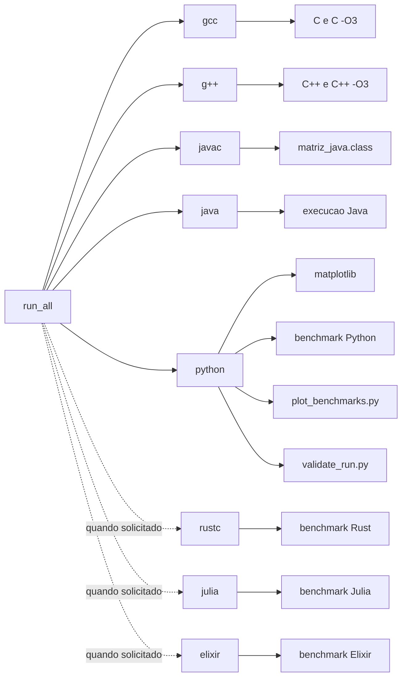

## Estados de uma Execucao

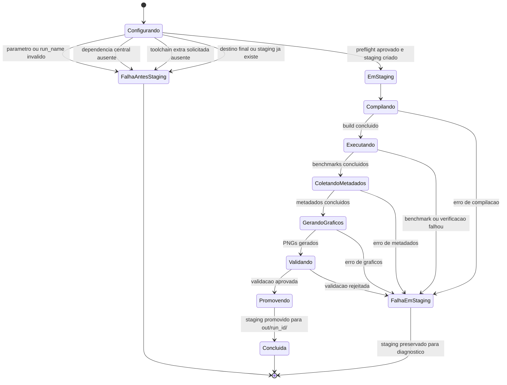

## Integracao de Nova Linguagem ao Fluxo Principal

Use este roteiro quando uma nova linguagem for promovida para `src/`. Rust, Julia e Elixir seguem esse modelo como linguagens opcionais por flag.

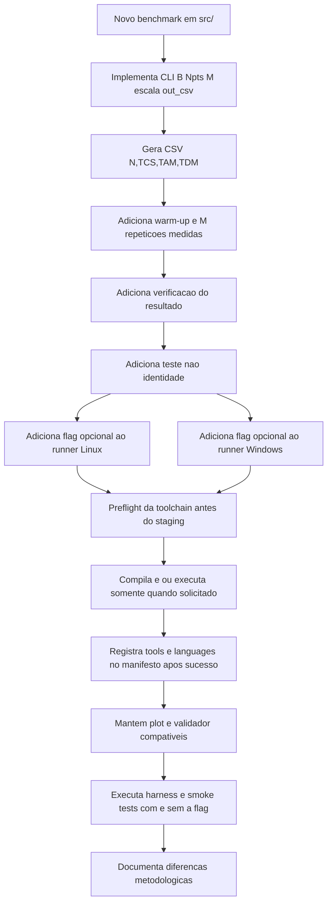

## Pontos de Atencao Metodologica

Resumo rapido. O desenho experimental completo esta em [METHODOLOGY.md](METHODOLOGY.md) e as ameacas a validade estao em [THREATS_TO_VALIDITY.md](THREATS_TO_VALIDITY.md).

- `TAM` cobre alocacao e inicializacao de A, B e do resultado quando a representacao permite pre-alocacao.
- Elixir e a excecao estrutural: o resultado imutavel e construido durante `TCS`.
- `TCS` mede a multiplicacao manual O(N^3), com ordem logica `i, j, k`.
- `TDM` mede liberacao explicita em C, C++ e Rust. Java, Python, Julia e Elixir registram `0.0`.
- O warm-up e descartado e nao entra na media de `M` repeticoes.
- A matriz identidade simplifica a verificacao amostral do benchmark, mas nao substitui os testes nao identidade.
- C e C++ possuem variantes com e sem `-O3`, enquanto Rust e integrado com `opt-level=3`.
- Comparacoes devem considerar layout de memoria, largura dos inteiros, JIT, GC, bounds-checks, imutabilidade e otimizacoes do compilador.
